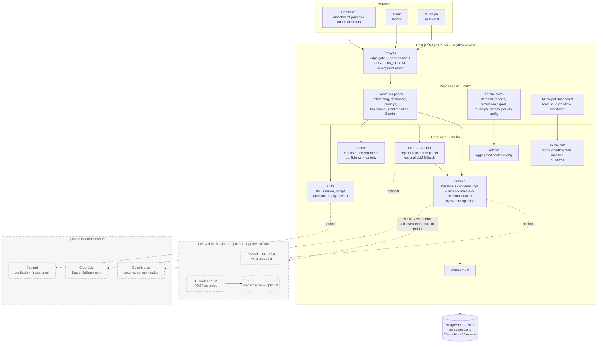

<div align="center">

# CityFlow AI

### We didn't build another map. We built the thing that decides when you should leave.

[](#tech-stack)
[](#tech-stack)
[](#tech-stack)
[](#tech-stack)
[](#tech-stack)
[](#does-it-actually-work)
[](#license)

[Live demo](#live-demo) · [The problem](#the-problem-we-kept-arguing-about) · [Architecture](#architecture) · [What's real vs. modeled](#whats-real-and-whats-modeled) · [Setup](#running-it-yourself)

</div>

---

## The problem we kept arguing about

Every traffic app we looked at answers the same question: *given the jam that already exists, which road gets you around it fastest?* Google Maps, Waze, every routing engine — they're all really good at rerouting you around congestion **after** it has already formed.

Nobody was answering a different, earlier question: **why did that many vehicles enter that road at that exact minute in the first place?**

That's the question CityFlow AI tries to answer. Not "which road" — "when." If a road can comfortably carry 40 vehicles every 15 minutes and 55 people all decide to leave for work between 8:45 and 9:00, the jam isn't a routing problem, it's a *scheduling* problem — and no amount of clever rerouting fixes a scheduling problem. Somebody has to leave 10 minutes earlier, or 10 minutes later, and the trick is figuring out *who* has that flexibility without just moving the exact same jam to 8:35 instead.

That's what this project spends most of its code on: a demand model that predicts how busy a departure slot is going to get, a re-optimiser that spreads confirmed trips across nearby slots instead of just relocating the peak, and three completely separate places — a commuter app, a city admin portal, and a municipal road-repair dashboard — that all read from the same live data instead of quietly drifting apart the way a lot of "connected" capstone projects do.

It started as a three-part college specification (a traveller dashboard, an admin panel, a municipal dashboard, each with its own detailed PDF brief). It didn't stay a checklist for long — once the demand model was actually running against real numbers, the interesting engineering problems showed up on their own: how do you re-optimise a whole city's worth of departures without creating a *new* peak fifteen minutes earlier? How do you let a road-condition report from a stranger's phone sensor reach a municipal officer's queue without ever exposing who that stranger is? How do you show someone "you'd save about 8 minutes" without that number quietly turning into a promise?

## Live demo

Three separate, live deployments, one shared database. Same code, same data, gated at the edge by role — a commuter can't reach `/admin`, and a municipal officer's dashboard has no code path that can query an individual's travel history at all.

| Portal | URL | Access |
|---|---|---|
| **Commuter** | **[cityflow-ai-git-main-shansit-s-projects.vercel.app](https://cityflow-ai-git-main-shansit-s-projects.vercel.app)** | Open — sign up and try it |
| **Admin** | [admin-cityflowai.vercel.app](https://admin-cityflowai.vercel.app) | Role-gated |
| **Municipal** | [municipal-portal-eight.vercel.app](https://municipal-portal-eight.vercel.app) | Role-gated |

The commuter portal is genuinely open — create an account, run through onboarding, and the recommendation engine is live against the real database, not a demo mode. Admin and Municipal require a role that's granted internally, since they hold city-wide aggregated data and a municipal workforce queue rather than anything self-serve.

> Free-tier hosting. The Postgres database and the Python ML service both idle down when nobody's used them for a while, so the very first request after a quiet period can take a few extra seconds to wake back up. That's infrastructure, not the app being slow.

## What's actually in it

Three portals, one Next.js app, one database — role-gated twice (at the edge in `proxy.ts`, and again against the database in every page and API route), so this was never three disconnected mocks pretending to talk to each other.

**Commuter** — onboarding captures a real travel routine (recurring trips, time windows, transport mode, how flexible you actually are); a demand model predicts how busy each departure slot is about to get and recommends a specific time to leave, with the reasoning shown, not just the answer. One-off trips ("going to a movie tonight") get their own planner. Saarthi, the in-app assistant, parses what you're asking for with a deterministic intent parser first and only asks a hosted LLM for help when the rules genuinely can't follow a sentence — every proposed change still needs a separate confirmation step before it touches your data, so the chatbot can suggest things but never silently acts on your behalf. Road-condition reporting works two ways: an explicit photo report, or an on-device accelerometer heuristic that flags a rough stretch of road without you doing anything.

**Admin** — nothing here is a hardcoded number. Every chart is a real Prisma query, aggregated so an admin can see "62% of commuters shifted their departure this week" but never *which* 62%. Demand heatmaps, a demand-shift dashboard (original-vs-current departure distribution, which slots are gaining or losing load, a day-by-day trend), the AI-assistant's aggregate intent stats (never raw chat text), a baseline-vs-CityFlow SUMO comparison, CSV report exports, and a notification center that really does store and display what you send — labeled "demo delivery" because nothing here is wired to an actual SMS or push provider, and we'd rather say that plainly than let the badge imply otherwise.

**Municipal** — the same `RoadIssue` reports the commuter app collects, running through an explicit state machine (`NEW → VERIFIED → ASSIGNED → ACKNOWLEDGED → IN_PROGRESS → COMPLETED → CLOSED`) with a full audit trail — because "who marked this repaired, and when" is exactly the question that gets asked six months later when somebody's wheel finds a pothole the records say was already fixed. A priority score blends evidence strength, severity, and how many people are actually exposed to it, and every employee has a real performance history (completion rate, overdue count, oldest open assignment) so a manual assignment decision is an *informed* one — deliberately not an auto-score, not a leaderboard, and nothing resembling GPS or attendance tracking.

## Architecture


The same architecture, as a native diagram (renders directly on GitHub):



**Why two services instead of one.** Prophet, XGBoost, and OR-Tools are Python, and none of them have a real JavaScript equivalent worth trusting in production — so the forecasting brain lives in a separate FastAPI service instead of being awkwardly ported.

**Why the web app doesn't fall over when that service naps.** Render's free tier sleeps a service after 15 minutes idle, which is exactly the kind of thing that takes a live demo down at the worst possible moment. So the ML client has a 2.5-second timeout and a silent fallback to a TypeScript demand model built directly into the web app — same interface, slightly less sophisticated math, recommendations that keep showing up either way. The Admin Portal's system-status page says which one actually produced the numbers on screen, so "it's degraded" is something you can verify, not something we're claiming and hoping is true.

**One codebase, up to four deployments.** By default all three portals answer on one URL — that's all local development or the Docker Compose stack ever needs. In production, each portal can instead be pointed at its own dedicated Vercel project — same repository, same database — restricted at the edge by setting `CITYFLOW_PORTAL` to `commuter`, `admin`, or `municipal`. That's exactly how the three live links above are actually deployed: three Vercel projects, one `main` branch, one Neon connection string.

## What's real, and what's modeled

This is the part most student projects gloss over, and it's the part we think actually matters. Every number CityFlow AI shows a user is one of exactly two things, and the product is built to never blur the line between them.

| Claim | Status | How you can check it |
|---|---|---|
| Departure-time recommendation | **Modeled** | A deterministic demand model (`src/lib/demand/demand-model.ts`), not a black box. Every recommendation ships with its own reasoning. |
| "You could save ~8 minutes" | **Modeled estimate, explicitly labeled** | Floored (never rounded up), suppressed below a 2-minute noise threshold, and always shown with the method that produced it — see `src/lib/demand/savings.ts`. |
| City-wide demand smoothing | **Measured, in simulation** | Independently re-run in SUMO on a real OpenStreetMap network — see [Does it actually work?](#does-it-actually-work) below. |
| Pothole/road-issue detection | **Real, on-device** | A genuine accelerometer + geolocation heuristic running in the browser, no server-side ML model pretending otherwise. |
| Admin analytics | **Real queries, aggregated** | Every chart is Prisma against the live database. Aggregated so nothing is ever traceable to one person. |
| AI assistant (Saarthi) | **Rule-based core + optional real LLM fallback** | A regex/time-parser pipeline handles the common cases; a hosted LLM (Groq) only steps in for phrasing the rules can't follow — and only when a key is actually configured. |
| Carpool matching | **Not built** | It's a single stated preference on your profile today, not a matching engine. We'd rather say that than let a checkbox imply more than it does. |
| Notification delivery | **Stored and displayed, not actually pushed** | The Admin Portal's notification composer really writes to the database and really shows up in the feed — it's labeled "demo delivery" because no SMS/push/email provider is wired in behind it. |
| Rewards / points | **Deliberately absent** | The brief explicitly ruled out gamification. The app says so directly rather than shipping a hidden or half-built rewards system. |

## Does it actually work?

We didn't just claim the demand-smoothing idea works — we re-ran it independently in [SUMO](https://eclipse.dev/sumo/) (Eclipse's open-source traffic simulator), on a real OpenStreetMap road network of central Bhopal, outside of anything the web app itself computes.

- **436** modelled road trips, across **20,815** drivable network edges
- **151 of 601** commuters (25%) had genuine flexibility to move and were reassigned
- The busiest 15-minute departure window dropped from **52 vehicles to 39 — a 25% reduction**
- Departures fell across the whole 08:00–09:45 peak and rose on the earlier shoulder, and — critically — **no new peak formed anywhere else**. That's the actual difference between *smoothing* demand and just *relocating* the same jam fifteen minutes down the road.

The other 75%? Either they'd declared a genuinely fixed departure time, or every nearby slot was already just as busy as the one they started in. We think that's a more honest number than pretending the optimiser can move everyone, and the full methodology — including the parameter sensitivity analysis and every limitation we found — is written up in [`docs/09-RESULTS.md`](docs/09-RESULTS.md).

## Tech stack

| Layer | Technology |
|---|---|
| Web framework | Next.js 16 (App Router) + TypeScript |
| Styling | Tailwind CSS v4, CSS-variable design tokens, full light/dark mode |
| Database | PostgreSQL (Neon serverless Postgres) |
| ORM | Prisma — 20 models, 20 enums |
| Auth | bcrypt password hashing + JWT session in an httpOnly cookie |
| Forecasting | Prophet + XGBoost (FastAPI service), calibrated against the real UCI *Metro Interstate Traffic Volume* dataset |
| Optimization | Google OR-Tools CP-SAT — multi-agent departure-slot assignment |
| Network modelling | NetworkX |
| Caching | Redis (optional) |
| Maps | Leaflet + OpenStreetMap |
| Weather | Open-Meteo (free, no API key) |
| Simulation | SUMO + OpenStreetMap road network |
| Road sensing | Browser `DeviceMotion` + Geolocation — no native app, no SDK |
| Email | Resend HTTP API (optional — logs to the terminal without it) |
| Containers | Docker Compose (web, ML, Postgres, Redis, Nginx) |
| CI | GitHub Actions — typecheck, Jest, production build, pytest |
| Hosting | Vercel (web, ×3 portals) + Render (ML service) |

## Running it yourself

```bash
git clone https://github.com/shreyagoyal9/cityflow-ai.git
cd cityflow-ai/web
npm install
cp .env.example .env      # fill in DATABASE_URL and AUTH_SECRET
npm run db:push
npm run dev
```

Open `http://localhost:3000`. The Python ML service is entirely optional here too — without it, the built-in TypeScript demand model runs everything, and the app tells you so.

Prefer one command for the whole stack (web + ML service + Postgres + Redis + Nginx, no accounts or API keys required)?

```bash
docker compose up --build
```

Open `http://localhost:8080`.

> Requires **Node 22+**, and for the ML service, **Python 3.10+** (3.9 will not work — see [`ml/README.md`](ml/README.md)). A full click-by-click walkthrough, including deploying your own copy for free, is in [`docs/00-SETUP-STEP-BY-STEP.md`](docs/00-SETUP-STEP-BY-STEP.md).

### Tests

```bash
cd web && npm test      # recommendation engine, trip planner, savings, workflow state machine
cd ml   && pytest       # forecasting, and the demand-smoothing claim itself
```

The ML suite is the one that matters most — it asserts the product's central claim directly in code: the optimiser **conserves total demand** (nobody is invented or deleted, just moved), **no slot ends up busier than the original peak**, and someone who declared zero flexibility is **never** reassigned, however much better the objective function would look if they were.

### Project structure

```
cityflow-ai/
├── web/                      # Next.js 16 app — all three portals, one codebase
│   ├── prisma/schema.prisma  #   20 models, 20 enums, the single source of truth
│   ├── src/
│   │   ├── app/               #   pages + API routes (commuter, /admin, /municipal)
│   │   ├── components/        #   UI, grouped by portal
│   │   ├── lib/                #   demand/, chat/, roads/, admin/, municipal/, auth/
│   │   └── proxy.ts            #   the edge gate — session role + CITYFLOW_PORTAL
│   └── scripts/                #   demo seeding, SUMO export, reoptimise, admin tools
├── ml/                        # FastAPI service — Prophet + XGBoost + OR-Tools
│   └── app/services/           #   forecast.py, optimizer.py, synthetic.py, network.py
├── docs/                      # setup guide, architecture, SUMO methodology, results
├── nginx/                     # reverse proxy config for the Docker Compose stack
└── docker-compose.yml         # the whole stack, one command
```

## Honest limitations & what's next

- The ML service's `/forecast` and `/optimize` endpoints are deployed, healthy, and **not yet wired into the live product** — every recommendation you'll see on the deployed sites today comes from the built-in TypeScript model. The Python service currently proves the harder math works in isolation (and its own test suite checks that); connecting it to live traffic is the natural next step.
- Multi-modal transport is an input you set, not a recommendation the system makes — it doesn't yet proactively suggest "take the metro instead."
- Carpool matching is a stated preference field today, not a working matcher.
- Demand smoothing structurally favors commuters with real schedule flexibility. Someone with a fixed shift or a school drop-off has little the system can do for them, and we'd rather say that plainly than let the participation framing imply the benefit is evenly spread.
- No production incident has ever needed the Municipal Dashboard's audit trail for real — it's been exercised with seeded and demo data, not a live city government.

## Team

Built by **Group 8** — [@shreyagoyal9](https://github.com/shreyagoyal9) and [@Shansit007](https://github.com/Shansit007) — as a capstone project. All three production deployments run from `main` on this repository.

## License

No license has been added to this repository yet — until one is, please treat this as "all rights reserved" and reach out before reusing it.

---

<div align="center">

CityFlow AI is an academic capstone project. It is not an official government service, and none of its traffic figures are a guarantee.

</div>
