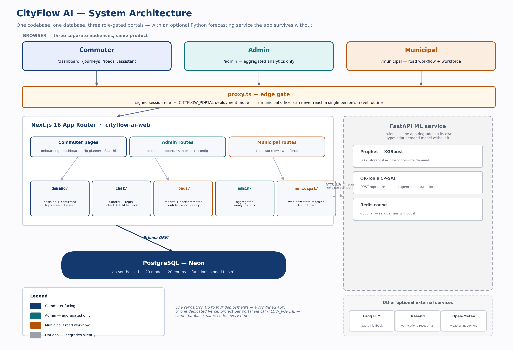
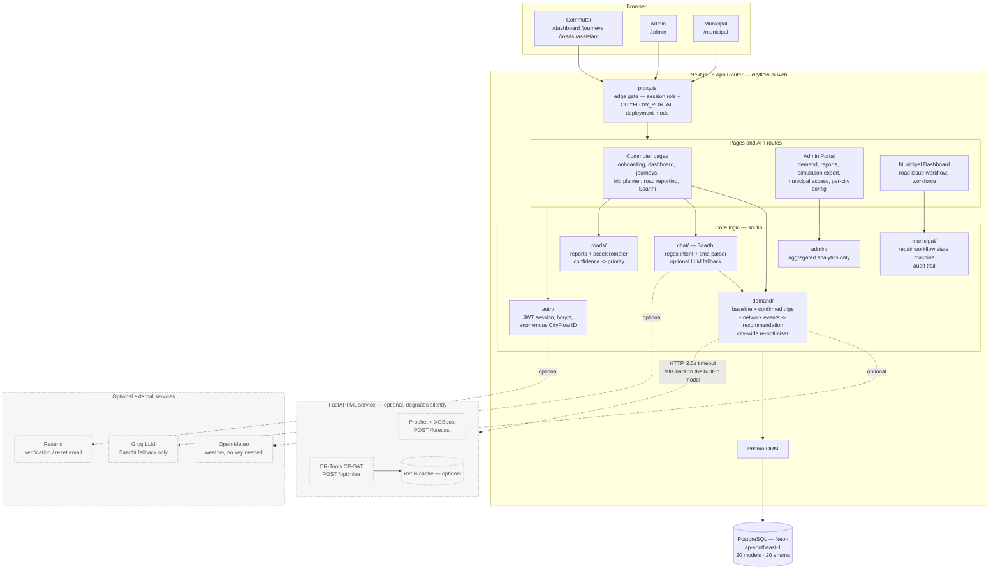

<div align="center">

# CityFlow AI

### Smarter departures. Smoother journeys.

> **"Google Maps tells you which road to take. CityFlow AI tries to stop the jam from forming in the first place."**

[](#tech-stack)
[](#tech-stack)
[](#tech-stack)
[](#tech-stack)
[](#tech-stack)
[](#does-it-actually-work)
[](#license)

[Live demo](#live-demo) · [Architecture](#architecture) · [Real vs. modeled](#whats-real-and-whats-modeled) · [Setup](#running-it-yourself)

</div>

---

Most traffic apps answer one question: *given the jam that already exists, which road gets you around it?* CityFlow AI answers the question before that one — **why did this many vehicles enter this road at this exact minute?** If a road can carry 40 vehicles every 15 minutes and 55 people all leave between 8:45 and 9:00, that's not a routing problem, it's a scheduling problem. So instead of rerouting people around congestion, CityFlow AI predicts demand ahead of time and nudges flexible commuters into nearby departure slots — smoothing the peak instead of just moving it.

It ships as three connected portals sharing one live database: a **commuter app**, a **city admin panel**, and a **municipal road-repair dashboard** — because a demand-smoothing system that only talks to commuters isn't useful to anyone who has to act on it.

Every supported city also gets its own hand-drawn skyline behind the UI — Delhi's India Gate, Mumbai's Marine Drive, Bengaluru's tech-park skyline, and so on — so the background changes with the city you pick instead of staying static.

## Live demo

| Portal | Link | Access |
|---|---|---|
| **Commuter** | **[cityflow-ai-git-main-shansit-s-projects.vercel.app](https://cityflow-ai-git-main-shansit-s-projects.vercel.app)** | Open — sign up and try it |
| **Admin** | [admin-cityflowai.vercel.app](https://admin-cityflowai.vercel.app) | Role-gated |
| **Municipal** | [municipal-portal-eight.vercel.app](https://municipal-portal-eight.vercel.app) | Role-gated |

Same code, same database, gated at the edge by role — a commuter can't reach `/admin`, and municipal has no code path that can ever query one person's travel history.

> Free-tier hosting — the database and the ML service idle down when unused, so the first request after a quiet spell can take a few extra seconds. That's infrastructure, not the app.

## What's in each portal

| Portal | Built for | Highlights |
|---|---|---|
| **Commuter** | Travellers | Real travel-routine onboarding · departure recommendation with reasoning shown, not just the answer · one-off trip planner · **Saarthi** assistant (rule-based intent parsing + optional LLM fallback, confirm-before-write) · road-issue reporting by photo or on-device accelerometer |
| **Admin** | The CityFlow team | Every chart is a live, aggregated Prisma query — never traceable to one person · demand heatmaps + demand-shift trends · baseline-vs-CityFlow SUMO comparison · CSV report exports · notification composer (honestly labeled "demo delivery") |
| **Municipal** | Council road staff | Road issues run through an explicit state machine (`NEW → VERIFIED → ASSIGNED → ACKNOWLEDGED → IN_PROGRESS → COMPLETED → CLOSED`) with a full audit trail · priority score from evidence + severity + exposure · per-employee performance history for informed (not automated) assignment |

## Architecture



<details>
<summary><strong>Native Mermaid version (renders on GitHub)</strong></summary>



</details>

| Design decision | Why |
|---|---|
| Forecasting in a separate FastAPI service | Prophet, XGBoost and OR-Tools are Python-only, and don't run on Vercel's serverless runtime |
| 2.5s timeout + silent TypeScript fallback | The free-tier ML service sleeps after 15 min idle — the app must never go down because of it. Admin's system-status page shows which model actually answered |
| One codebase, up to four deployments | `CITYFLOW_PORTAL=commuter\|admin\|municipal` restricts a Vercel project to one portal at the edge — same repo, same database, no forked builds |

## What's real, and what's modeled

| Claim | Status |
|---|---|
| Departure-time recommendation | **Modeled** — deterministic demand model, reasoning shown with every result |
| "You could save ~8 minutes" | **Modeled estimate** — floored, suppressed under a 2-min noise threshold, method always shown |
| City-wide demand smoothing | **Measured in simulation** — independently re-run in SUMO ([results](#does-it-actually-work)) |
| Road-issue detection | **Real, on-device** — accelerometer + geolocation heuristic, no server ML pretending otherwise |
| Admin analytics | **Real, aggregated** — live Prisma queries, never traceable to one person |
| Saarthi assistant | **Rule-based core + optional real LLM fallback** — hosted LLM only when a key is configured |
| Carpool matching | **Not built** — a stated preference field today, not a matching engine |
| Notification delivery | **Stored + displayed, not pushed** — labeled "demo delivery"; no SMS/push provider wired in |
| Rewards / points | **Deliberately absent** — ruled out on purpose, not half-built |

## Does it actually work?

Re-run independently in [SUMO](https://eclipse.dev/sumo/) on a real OpenStreetMap network of central Bhopal — outside anything the web app itself computes:

| Metric | Result |
|---|---|
| Modelled road trips | 436, across 20,815 drivable edges |
| Commuters reassigned | 151 of 601 (25%) had genuine flexibility |
| Busiest 15-min window | **52 → 39 vehicles (−25%)** |
| New peak formed elsewhere? | **No** — the actual difference between smoothing demand and relocating it |

The other 75% had either declared a fixed departure or found every nearby slot just as busy. Full methodology and every limitation found: [`docs/09-RESULTS.md`](docs/09-RESULTS.md).

## Tech stack

| Layer | Technology |
|---|---|
| Web framework | Next.js 16 (App Router) + TypeScript |
| Styling | Tailwind CSS v4, CSS-variable tokens, full light/dark mode |
| Database / ORM | PostgreSQL (Neon) · Prisma — 20 models, 20 enums |
| Auth | bcrypt + JWT session in an httpOnly cookie |
| Forecasting | Prophet + XGBoost, calibrated on the real UCI *Metro Interstate Traffic Volume* dataset |
| Optimization | Google OR-Tools CP-SAT — multi-agent departure-slot assignment |
| Network / caching | NetworkX · Redis (optional) |
| Maps / weather | Leaflet + OpenStreetMap · Open-Meteo |
| Simulation | SUMO + OpenStreetMap road network |
| Road sensing | Browser `DeviceMotion` + Geolocation — no app, no SDK |
| Email | Resend (optional — logs to terminal without it) |
| Containers / CI | Docker Compose · GitHub Actions (typecheck, Jest, build, pytest) |
| Hosting | Vercel (web, ×3 portals) + Render (ML service) |

## Running it yourself

```bash
git clone https://github.com/shreyagoyal9/cityflow-ai.git
cd cityflow-ai/web
npm install
cp .env.example .env      # fill in DATABASE_URL and AUTH_SECRET
npm run db:push
npm run dev                # → http://localhost:3000
```

Or the whole stack in one command (web + ML + Postgres + Redis + Nginx, no keys needed):

```bash
docker compose up --build   # → http://localhost:8080
```

> Needs **Node 22+**, and **Python 3.10+** for the ML service. Full walkthrough: [`docs/00-SETUP-STEP-BY-STEP.md`](docs/00-SETUP-STEP-BY-STEP.md).

```bash
cd web && npm test      # recommendation engine, trip planner, savings, workflow
cd ml   && pytest       # forecasting + the demand-smoothing claim itself
```

The ML suite asserts the product's central claim in code: the optimiser **conserves total demand**, **never** creates a slot busier than the original peak, and **never** reassigns someone who declared zero flexibility.

## Project structure

```
cityflow-ai/
├── web/                      # Next.js 16 app — all three portals, one codebase
│   ├── prisma/schema.prisma  #   20 models, 20 enums, single source of truth
│   ├── src/
│   │   ├── app/               #   pages + API routes (commuter, /admin, /municipal)
│   │   ├── components/        #   UI, grouped by portal
│   │   ├── lib/                #   demand/, chat/, roads/, admin/, municipal/, auth/
│   │   └── proxy.ts            #   the edge gate — session role + CITYFLOW_PORTAL
│   └── scripts/                #   demo seeding, SUMO export, reoptimise, admin tools
├── ml/                        # FastAPI service — Prophet + XGBoost + OR-Tools
├── docs/                      # setup guide, architecture, SUMO methodology, results
├── nginx/                     # reverse proxy for the Docker Compose stack
└── docker-compose.yml         # the whole stack, one command
```

## Honest limitations

| Limitation | Why it matters |
|---|---|
| ML service is deployed but not wired into live recommendations | Everything live today runs on the built-in TypeScript model |
| No mode-switch suggestions | Transport mode is an input you set, not something the system recommends |
| Carpool matching isn't real yet | It's a stated preference, not a matcher |
| Flexibility-based benefit | A fixed-shift commuter gets little from demand smoothing — we say so plainly rather than implying otherwise |

## Team

Built by **Group 8**.

## License

No license added yet — until one is, treat this as all-rights-reserved and reach out before reusing it.

---

<div align="center">

CityFlow AI is an academic capstone project — not an official government service, and none of its figures are a guarantee.

</div>
